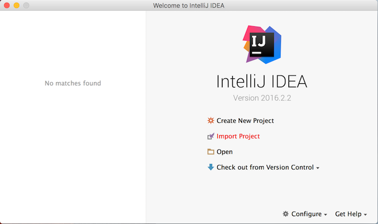
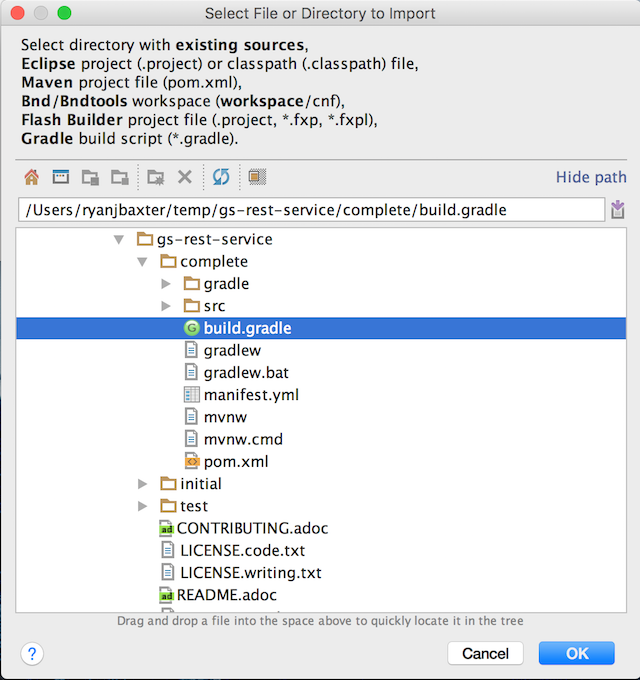
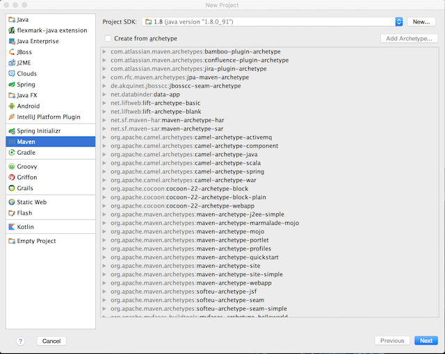

:spring_boot_version: 1.2.5.RELEASE
:jdk: http://www.oracle.com/technetwork/java/javase/downloads/index.html
:gs-maven: link:/guides/gs/maven
:gs-gradle: link:/guides/gs/gradle
:gs-consuming-rest: link:/guides/gs/consuming-rest
:toc:
:icons: font
:source-highlighter: prettify
:project_id: gs-intellij-idea

本指南通过使用 IntelliJ IDEA 来构建一个入门指南。

== 你将构建什么

您将选择一个Spring指南并将其导入IntelliJ IDEA中。然后您可以阅读指南，编写代码，并运行该项目。

== 你需要什么

 - 大概15分钟
 - https://www.jetbrains.com/idea/download/[IntelliJ IDEA]
 - {jdk}[JDK 8] 或更新的版本

== 安装 IntelliJ IDEA
如果您还没有安装 IntelliJ IDEA ，请访问上面的链接。从那里，您可以为您的平台下载一个副本。要安装它只需解压缩下载的档案。

当你完成后，继续启动 IntelliJ IDEA 。

== 导入入门指南

随着STS的启动和运行，从 **Welcome Screen** 点击 **Import Project** 或者主菜单上的 **File | Open** :

在弹出的对话框中一定要选择 **complete** 文件夹下的 {gs-maven}[Maven] 的 **pom.xml** 或 {gs-gradle}[Gradle]的 **build.gradle** 文件：

所有代码从引导导入后，IntelliJ IDEA将创建整个项目的。

如果你想创建一个空项目，并通过复制并粘贴的方式完成向导，在项目向导创建一个新的 *Maven* 或 *Gradle* 项目：

== 参考

下面的指南可能也有帮助：

* http://knos.top/guides/gs/sts/[使用STS运行入门指南]
